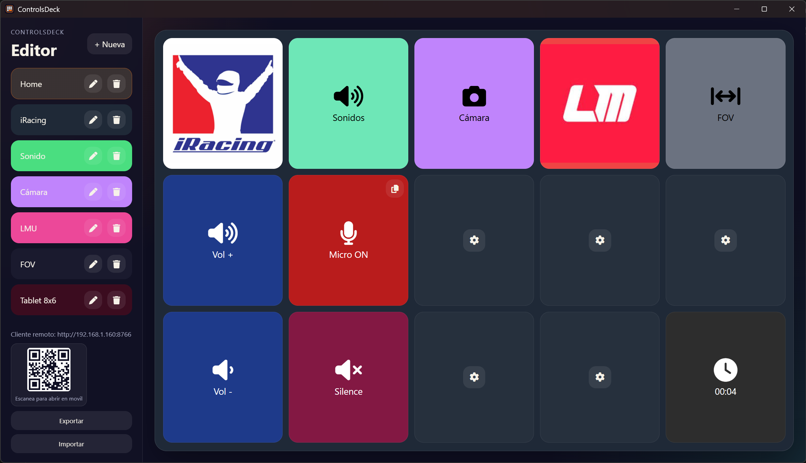
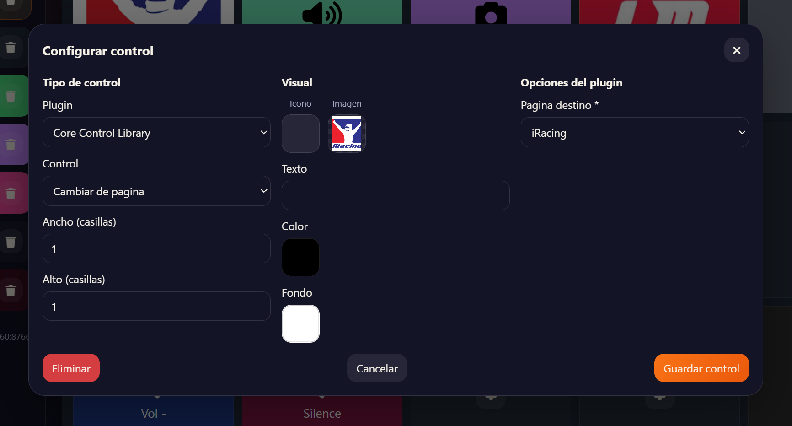
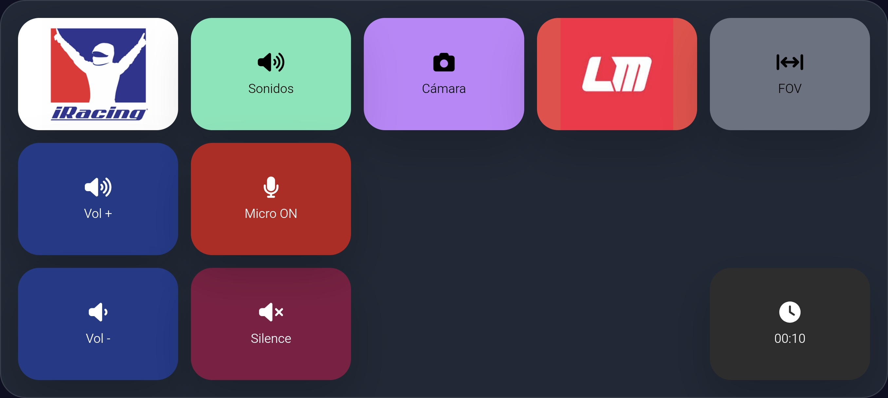
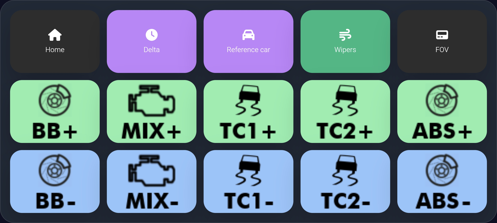
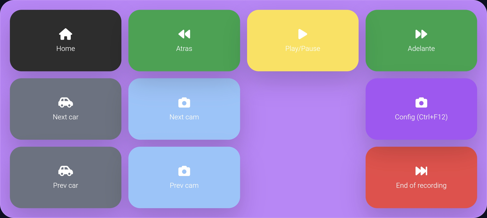
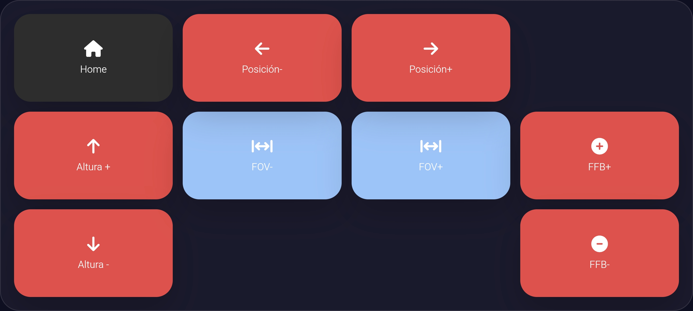
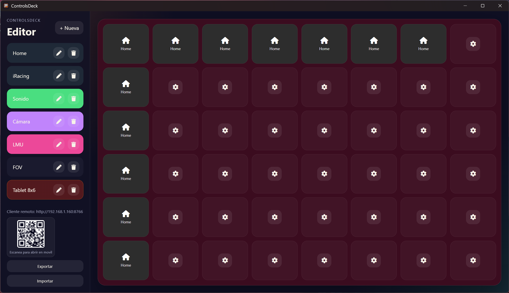

# ControlsDeck

**ControlsDeck** is a remote control system that lets you manage desktop actions from any mobile device or web browser. Design custom control pages on your desktop, then trigger them remotely — all in real time over your local network.

## Features

- **Desktop Editor** — Electron-based visual editor for designing control pages with a drag-and-drop grid layout.
- **Mobile Client (PWA)** — Progressive Web App that works on any device with a browser. Installable for a fullscreen, native-app feel.
- **Real-Time Sync** — Controls and state updates are instantly synchronized between the editor and all connected clients via WebSocket.
- **Plugin System** — Extensible architecture: build your own control libraries and drop them in to add new functionality.
- **Cross-Platform** — The server runs on Windows, macOS, and Linux. The client runs on any browser.
- **QR Code Access** — Scan a QR code from the editor sidebar to instantly open the remote client on your phone.
- **Export / Import** — Save and restore your entire configuration as a JSON file.

## Getting Started

### Prerequisites

- **Node.js** v26 or later
- **npm**

### Installation

1. **Install the server:**

   ```bash
   cd controldeck-server
   npm install
   ```

2. **Build the core control library (optional — a pre-built bundle is included):**

   ```bash
   cd controldeck-corecontrollibrary
   npm install
   npm run build
   ```

3. **Start the application:**

   ```bash
   cd controldeck-server
   npm start
   ```

   The Electron editor window will open. The remote client URL and QR code are displayed in the sidebar.

### Building the Executable

To package ControlsDeck as a standalone `.exe` that can be distributed without requiring Node.js:

1. **Install dependencies** (if not already done):

   ```bash
   cd controldeck-server
   npm install
   ```

2. **Run the build:**

   ```bash
   npm run build
   ```

   This uses `electron-builder` to create a portable distribution in `controldeck-server/dist/win-unpacked/`.

3. **Output:**

   ```
   dist/
   └── win-unpacked/
       ├── ControlsDeck.exe      ← Main executable
       ├── resources/
       │   └── app.asar          ← Bundled application code
       └── ... (Chromium DLLs, etc.)
   ```

### Distributing

Zip the entire `dist/win-unpacked/` folder and share it. No installation is required — the recipient just extracts the zip and runs `ControlsDeck.exe`.

### Running the Executable

1. Double-click `ControlsDeck.exe` (or run it from a terminal).
2. The editor window opens. The WebSocket server (port 8765) and HTTP server (port 8766) start automatically.
3. Connect from a mobile device using the URL or QR code shown in the sidebar.

> **Note:** Windows may show a SmartScreen warning on first launch since the executable is not code-signed. Click **More info → Run anyway** to proceed.

### Connecting from a Mobile Device

1. Make sure your mobile device is on the **same Wi-Fi network** as the computer running ControlsDeck.
2. Open the URL shown in the editor sidebar (e.g. `http://192.168.1.100:8766`) or scan the QR code.
3. The PWA client will auto-connect to the server. You can install it as an app for a fullscreen experience.

---

## User Guide

### Main Page (Editor)

The editor is the central workspace where you design your control pages.



**Sidebar (left):**
- Lists all your pages. Drag and drop to reorder them.
- Click **+ Nueva** to add a new page.
- Right-click or use the edit/delete buttons to rename or remove a page.
- The **Remote URL** and a **QR code** are shown at the bottom — use them to connect from a mobile device.
- **Export** and **Import** buttons let you save and restore your full configuration.

**Workspace (center):**
- Displays a grid layout for the currently selected page.
- Click the **+** button in any empty cell to add a new control.
- Controls can span multiple columns and rows.
- Hover over a control card to reveal a **Copy** button. Empty cells will then show a **Paste** button.

**Page settings:**
- Each page has a configurable **name**, **column count** (1–12), **row count** (1–8), and **background color**.

---

### Control Configuration

Clicking the **+** button on an empty cell (or editing an existing control) opens the control configuration modal.



**Control Type Section:**
- **Plugin** — Select which plugin provides the control (e.g. *Core Controls*).
- **Control** — Choose the specific control type from that plugin (e.g. *Clock*, *Keypress*).
- **Width / Height** — How many grid cells the control spans (column span and row span).

**Visual Section:**
- **Icon** — Opens a searchable icon picker with the full Font Awesome 6 catalog.
- **Image** — Upload an image (PNG, JPEG, WebP, GIF, SVG; max 200 KB) to use as the control background.
- **Text** — A label displayed on the control.
- **Color** — Foreground color for the icon and text (basic palette or advanced hex input).
- **Background Color** — The control card's background color.

**Plugin Options Section:**
- Dynamic fields defined by the selected control type. For example, the Clock control shows a **Format** dropdown; the Keypress control shows a **Key** field and modifier toggles.

---

### Remote Device (PWA)

The remote client is a lightweight Progressive Web App that mirrors the control grid.



- The layout matches exactly what you configured in the editor — same grid, same colors, same icons.
- **Tap** a button control to trigger its action. A press animation provides visual feedback.
- **Drag** a slider control (horizontal or vertical) to send continuous value updates.
- If the connection is lost, a banner appears and the client automatically reconnects with exponential backoff.
- On first visit, an **install hint** suggests how to add the app to your home screen (iOS: *Share → Add to Home Screen*; Android: *Menu → Install App*).

#### Other examples:
Car setup:



Camera control:



FOV & FFB:



Tablet 8x6:




---

## Core Controls

ControlsDeck ships with a built-in plugin called **Core Control Library** (`corecontrollibrary`) that includes four controls:

### Clock

Displays the current time with live updates every second.

| Option | Type | Default | Description |
|--------|------|---------|-------------|
| `format` | select | `HH:mm:ss` | Time format: `HH:mm` (24h short), `HH:mm:ss` (24h long), or `hh:mm A` (12h with AM/PM) |

The clock control is display-only — tapping it does nothing.

### Page Switcher

A button that navigates to a different page when tapped. Use it to build multi-page navigation on the remote client (since the PWA has no page tabs).

| Option | Type | Required | Description |
|--------|------|----------|-------------|
| `targetPageId` | page | Yes | The page to navigate to when the button is pressed |

### Microphone Toggle

Mutes and unmutes the system microphone. The control visually reflects the current state:
- **Unmuted:** green background, microphone icon.
- **Muted:** red background, slashed microphone icon.

Works on:
- **Windows** — via `nircmd.exe` and a PowerShell script
- **macOS** — via `osascript`
- **Linux** — via `pactl` (PulseAudio)

No additional configuration options.

### Keypress

Sends keyboard key presses and shortcuts to the host computer (Windows only, via `nircmd`).

| Option | Type | Default | Description |
|--------|------|---------|-------------|
| `mode` | select | `basic` | UI display mode (`basic` or `advanced`) |
| `key` | text | *(required)* | The key to press (`a`–`z`, `0`–`9`, `F1`–`F24`, `space`, `enter`, `esc`, `tab`, arrow keys, etc.) |
| `ctrl` | boolean | `false` | Hold Ctrl |
| `shift` | boolean | `false` | Hold Shift |
| `alt` | boolean | `false` | Hold Alt |
| `windows` | boolean | `false` | Hold the Windows key |

The display text is auto-generated from the key combination (e.g. `CTRL+SHIFT+S`).

---

## Developing Custom Plugins

ControlsDeck's plugin system lets you create your own control libraries. A plugin is a folder containing a **manifest** and a **CommonJS bundle**.

### Project Structure

```
my-plugin/
├── manifest.json          # Plugin metadata and control definitions
├── package.json           # npm project (devDependency: esbuild)
├── build.js               # Build script
└── src/
    ├── index.js           # Entry point — exports all controls
    └── controls/
        └── my-control.js  # Individual control implementation
```

### 1. Define the Manifest

`manifest.json` describes your plugin and declares which controls it provides.

```json
{
  "id": "com.example.my-plugin",
  "name": "My Plugin",
  "version": "1.0.0",
  "author": "Your Name",
  "description": "A custom plugin for ControlsDeck",
  "bundleFile": "bundle.js",
  "controls": [
    {
      "typeId": "my-control",
      "name": "My Control",
      "description": "Does something useful",
      "controlType": "button",
      "configSchema": [
        {
          "key": "message",
          "label": "Message",
          "type": "text",
          "required": true
        },
        {
          "key": "repeat",
          "label": "Repeat count",
          "type": "number",
          "defaultValue": 1
        }
      ]
    }
  ]
}
```

**`controlType`** can be `"button"`, `"slider-h"` (horizontal slider), or `"slider-v"` (vertical slider).

**`configSchema`** field types: `text`, `number`, `color`, `select`, `boolean`, `page`.

### 2. Implement the Control

Each control module must export four lifecycle methods:

```javascript
// src/controls/my-control.js

module.exports = {
  /**
   * Returns the initial visual state of the control.
   * Called once when the control is first rendered.
   * @param {Object} config - The control's configuration values
   * @returns {{ icon: string, text: string, color: string, backgroundColor: string }}
   */
  getInitialState(config) {
    return {
      icon: config.icon || 'fa-star',
      text: config.text || 'Hello',
      color: config.color || '#ffffff',
      backgroundColor: config.backgroundColor || '#2d2d2d',
    };
  },

  /**
   * Called when the control is loaded into the runtime.
   * Use this to set up timers, listeners, or any background work.
   * Call sendState() to push visual updates to all connected clients.
   * @param {Object} config - The control's configuration values
   * @param {string} controlId - Unique ID of this control instance
   * @param {Function} sendState - Call with a state object to update the UI
   * @param {Object} helpers - Utility methods (e.g. helpers.t() for i18n)
   */
  onLoad(config, controlId, sendState, helpers) {
    // Example: nothing to set up
  },

  /**
   * Called when the user triggers the control (tap, click, or slider change).
   * @param {Object} config - The control's configuration values
   * @param {Object} payload - Action payload (e.g. { value } for sliders)
   * @param {Function} sendState - Call with a state object to update the UI
   * @param {Object} helpers - Utility methods
   */
  onAction(config, payload, sendState, helpers) {
    console.log('Control triggered!', config.message);
    sendState({
      icon: 'fa-check',
      text: 'Done!',
      color: '#00ff00',
      backgroundColor: '#1a1a2e',
    });
  },

  /**
   * Called when the control is unloaded (page changed, control deleted, etc.).
   * Clean up any timers or listeners here.
   * @param {Object} config - The control's configuration values
   * @param {string} controlId - Unique ID of this control instance
   */
  onUnload(config, controlId) {
    // Example: nothing to clean up
  },
};
```

### 3. Create the Entry Point

The entry point must export a `controls` object mapping each `typeId` to its module:

```javascript
// src/index.js
module.exports = {
  controls: {
    'my-control': require('./controls/my-control'),
  },
};
```

> The keys in `controls` must match the `typeId` values in `manifest.json`.

### 4. Build the Bundle

Use [esbuild](https://esbuild.github.io/) to bundle your source into a single CommonJS file:

```javascript
// build.js
const esbuild = require('esbuild');
const fs = require('fs');

async function build() {
  fs.mkdirSync('dist', { recursive: true });
  await esbuild.build({
    entryPoints: ['src/index.js'],
    bundle: true,
    platform: 'node',
    format: 'cjs',
    outfile: 'dist/bundle.js',
  });
  fs.copyFileSync('manifest.json', 'dist/manifest.json');
  // Copy any additional files your controls need (scripts, binaries, etc.)
}

build().catch((err) => {
  console.error(err);
  process.exit(1);
});
```

Run the build:

```bash
npm install
npm run build
```

The `dist/` folder will contain your `bundle.js` and `manifest.json`.

### 5. Install the Plugin

Copy the contents of `dist/` into the ControlsDeck plugins directory:

```
controldeck-server/plugins/my-plugin/
├── manifest.json
├── bundle.js
└── (any additional files)
```

Restart ControlsDeck. Your new controls will appear in the editor's control type dropdown.
